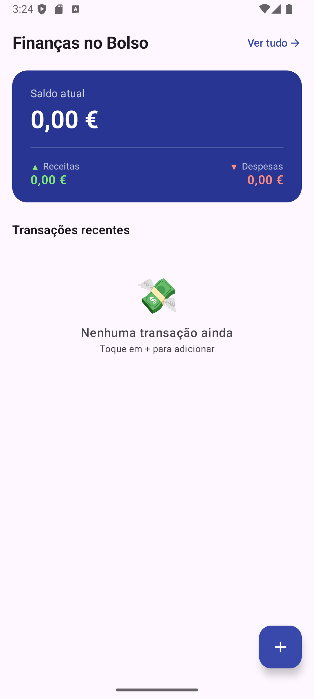

# 💰 Finanças de Bolso


**Personal finance Android app built with Kotlin and Jetpack Compose to help users track income and expenses.**

---

## 📸 Screenshots

<p align="center">
  
  &nbsp;&nbsp;&nbsp;
  
</p>

---

## 📱 Features

- ✅ Register income and expense transactions
- ✅ Real-time financial balance overview
- ✅ Transaction history list
- ✅ Category-based organization
- ✅ Clean and intuitive UI with Material Design 3
- ✅ Light and dark theme support

---

## 🏗️ Architecture

```
com.example.financasdebolso/
│
├── 📱 MainActivity.kt                  # Main entry point
│
├── 🧩 ui/                              # UI layer
│   ├── components/                    # Reusable UI components
│   │   ├── BalanceCard.kt             # Total balance display
│   │   ├── TransactionItem.kt         # Individual transaction card
│   │   └── TransactionList.kt         # Scrollable transaction history
│   └── utils/
│       └── Formatters.kt              # Currency and date formatters
│
├── 🧠 viewmodel/                       # ViewModel layer
│   └── FinanceViewModel.kt            # State and operation management
│
├── 🎯 domain/                          # Business logic (Use Cases)
│   ├── GetTotalIncomeUseCase.kt        # Calculates total income
│   └── GetTotalExpenseUseCase.kt       # Calculates total expenses
│
├── 📊 model/                           # Data models
│   └── Transaction.kt                 # Transaction data class
│
└── 🎨 ui/theme/                        # Material 3 theme
    ├── Color.kt
    ├── Theme.kt
    └── Type.kt
```

### Design Principles Applied

- **MVVM Architecture** — clear separation between UI and business logic
- **Clean Architecture** — domain layer with dedicated Use Cases
- **Unidirectional Data Flow** — state flows down, events flow up
- **Single Responsibility** — each component has one clear purpose
- **Clean Code** — readable and self-documented code

---

## 🔧 Technologies

| Technology          | Version | Description                         |
|---------------------|---------|-------------------------------------|
| **Kotlin**          | 1.9+    | Modern, concise Android language    |
| **Jetpack Compose** | 1.5+    | Declarative and reactive UI toolkit |
| **MVVM**            | —       | Architecture pattern                |
| **Clean Architecture** | —    | Use Cases for business logic        |
| **Coroutines**      | 1.7+    | Asynchronous programming            |
| **StateFlow**       | —       | Reactive state management           |
| **Material 3**      | Latest  | Google's design system              |
| **Android SDK**     | 24+     | Compatible with 95%+ of devices     |

---

## 🚀 Getting Started

### Prerequisites

- Android Studio Hedgehog (2023.1.1) or higher
- JDK 17+
- Android SDK 34
- Physical device or emulator with API 24+

### Steps

1. **Clone the repository**
   ```bash
   git clone https://github.com/TallesGuerra/FinancasDeBolso.git
   cd FinancasDeBolso
   ```

2. **Open in Android Studio**
   - File → Open → Select the project folder

3. **Sync dependencies**
   - Gradle will sync automatically

4. **Run the app**
   - Click **Run** ▶️ or press `Shift + F10`
   - Select a device or emulator

---

## 💡 Concepts Demonstrated

- **MVVM** with ViewModel and StateFlow for reactive state management
- **Clean Architecture** with dedicated Use Cases for business logic
- **Coroutines** with `viewModelScope` for asynchronous operations
- `collectAsState()` for collecting StateFlow in Composables
- Jetpack Compose layouts and Material Design 3 components
- List rendering with `LazyColumn`
- Data modeling with Kotlin data classes
- Modular and reusable component architecture

---

## 🔄 Roadmap

- [x] Add and display transactions
- [x] Real-time balance calculation
- [x] Transaction history
- [x] MVVM architecture with ViewModel + StateFlow
- [x] Clean Architecture with Use Cases
- [x] Coroutines integration
- [ ] Local persistence with Room Database
- [ ] Expense categories and filters
- [ ] Monthly spending charts

---

## 👨‍💻 Author

- 📧 [talles-guerra@hotmail.com](mailto:talles-guerra@hotmail.com)
- 💼 [LinkedIn](https://www.linkedin.com/in/talles-guerra/)
- 🐙 [GitHub](https://github.com/TallesGuerra)

---

**Made with ❤️ and Jetpack Compose**
